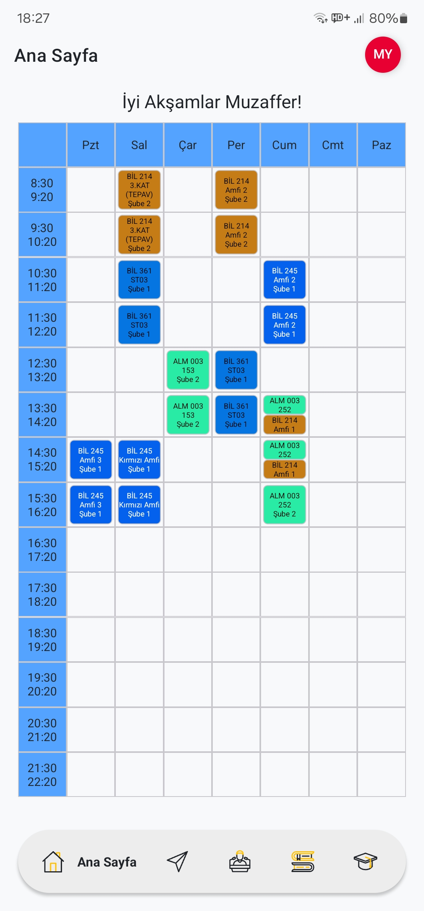
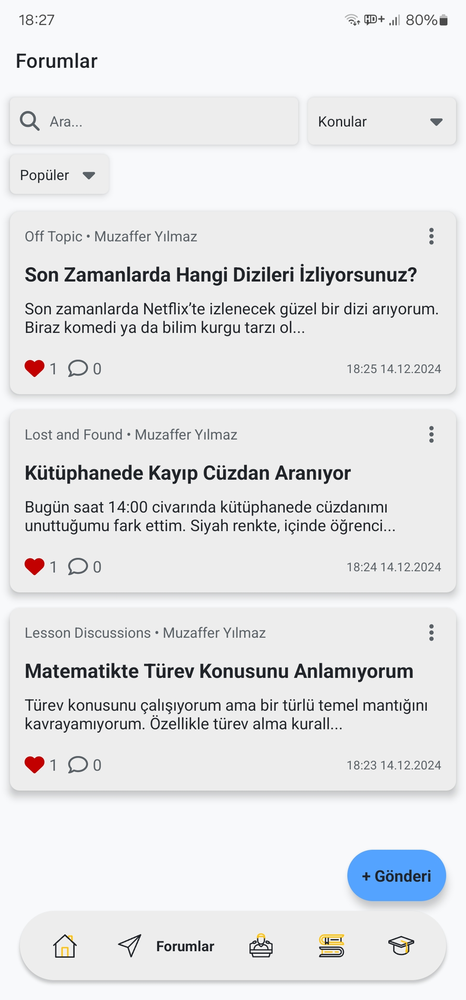
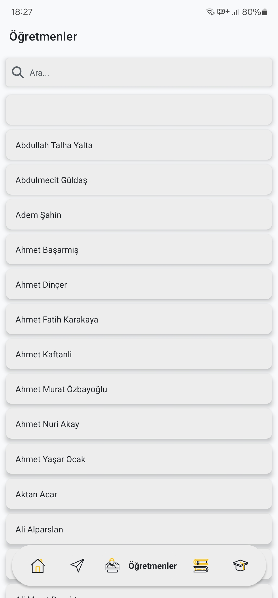
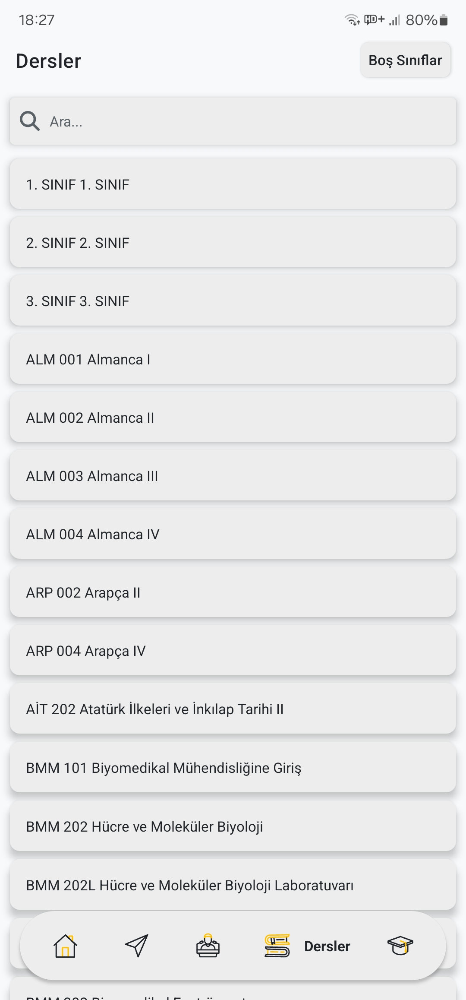
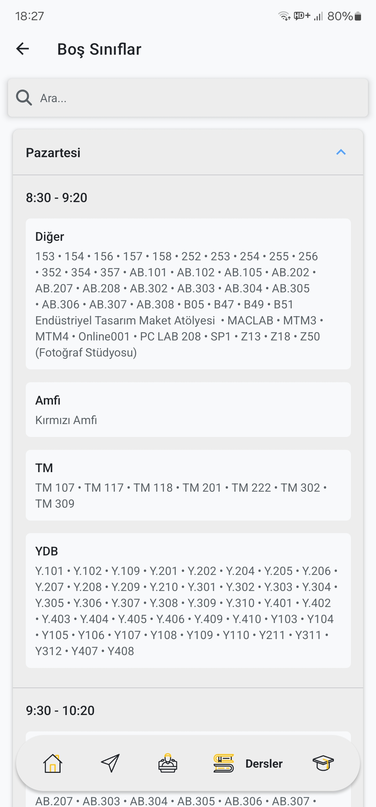
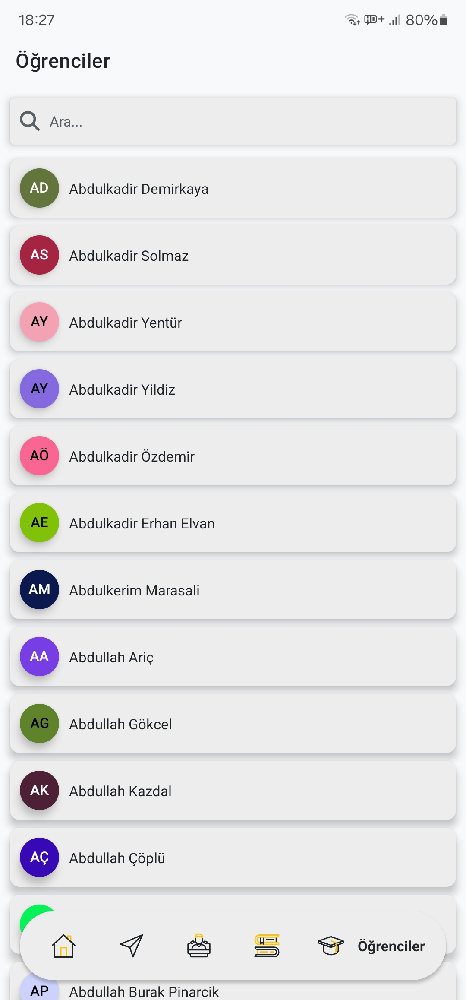

# ETUPedia

Your guide to TOBB ETÜ's life, connecting with students and more.

## Description

ETUPedia is your ultimate companion for navigating university life. Whether you're a student or a teacher, ETUPedia provides a seamless experience to access essential information and stay connected with the TOBB ETÜ community.

## Features

* Student Information: Easily access and manage student details, including names, IDs, departments, and contact information.
* Lesson Details: Get comprehensive information about lessons, including lesson names, codes, and student counts.
* Teacher Directory: Browse and connect with teachers, view their profiles, and stay updated with their schedules.
* Forums: Engage in discussions, share knowledge, and stay informed about the latest university news and events.
* Multi-language Support: Available in multiple languages to cater to a diverse user base.
* Dark Mode: Switch between light and dark themes based on your preference or system settings.
* ETUPedia is designed to enhance your university experience by providing a centralized platform for all your academic needs. Download now and stay connected with the TOBB ETÜ community!

## Download

[Get ETUPedia on the Play Store](https://play.google.com/store/apps/details?id=com.thnorty.etupedia)

## Frontend Repository

[Frontend GitHub Repository](https://github.com/Thnorty/ETUPedia-frontend)

## Screenshots

### Main Screen

### Forum Screen

### Teachers Screen

### Lessons Screen

### Empty Classrooms Screen

### Students Screen

